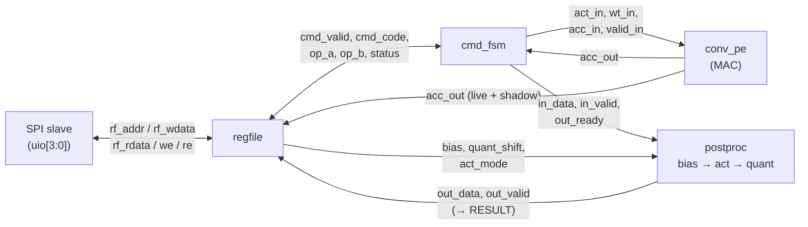

<!---

This file is the public datasheet for `tt_um_arty3_mac_engine`. For the
authoritative specification (electrical, timing, edge cases, test matrix)
see `docs/SPEC.md` in the repositor or the link below.

-->

## How it works

`tt_um_arty3_mac_engine` is a standalone signed-INT8 multiply–accumulate
(MAC) engine with an on-chip post-processing pipeline, controlled over a
4-wire SPI slave. It is intended as a co-processor for quantized neural-
network inference on a small MCU: the host streams operands and bias
values over SPI, issues compute commands, and reads back an INT8 result.

### Block diagram



- **`conv_pe`** - a single signed INT8 x INT8 → INT32 MAC with a registered
  accumulator. One MAC per `CMD_MAC`, no internal storage besides the
  accumulator.
- **`postproc`** - three-stage pipeline: `bias_add` → `activation` (NONE /
  ReLU / Leaky ReLU, slope = 1/8) → `quantize` (arithmetic right shift +
  signed saturation to INT8). Latency: 3 cycles.
- **`cmd_fsm`** - 7-state sequencer (IDLE, MAC, CLR, PP_FEED, PP_WAIT,
  SOFTRST, DOT4) that owns the handshake to `conv_pe` and `postproc`.
- **`regfile`** - 7-bit-addressed byte-wide register file. Holds operands,
  bias, quantizer/activation configuration, status flags, and the read
  ports for the accumulator and the result.
- **`spi_slave`** - mode 0 (CPOL=0, CPHA=0), MSB-first. Every transaction
  is exactly 16 SCLK cycles framed by CS_N.

### Register map (summary)

All registers are 8 bits. The top bit of the SPI header is R/W#; the low
7 bits are the address.

| Addr  | Name          | R/W | Reset | Description |
|-------|---------------|-----|-------|-------------|
| 0x00  | `STATUS`      | RO  | 0x01  | `{0000, ACC_OVF_STK, RESULT_VALID, BUSY, IDLE}` |
| 0x01  | `CMD`         | WO  | -     | Writing launches a command (see below) |
| 0x02  | `OP_A`        | RW  | 0x00  | INT8 multiplicand A |
| 0x03  | `OP_B`        | RW  | 0x00  | INT8 multiplicand B |
| 0x04  | `BIAS`        | RW  | 0x00  | INT8 bias added in `postproc` |
| 0x05  | `QUANT_SHIFT` | RW  | 0x00  | Arithmetic right shift (0–31) applied in `postproc` |
| 0x06  | `ACT_MODE`    | RW  | 0x00  | `00`=None, `01`=ReLU, `10`=LeakyReLU(α=1/8) |
| 0x08–0x0B | `ACC_B0..B3` | RO | 0x00 | Accumulator, little-endian. Reading `ACC_B0` snapshots the upper bytes into a coherent shadow. |
| 0x0C  | `RESULT`      | RO  | 0x00  | INT8 output of the last `CMD_POSTPROC`. Reading clears `RESULT_VALID`. |
| 0x10  | `FEATURE_ID`  | RO  | 0xA1  | Engine family + revision |
| 0x12  | `OP_A1`       | RW  | 0x00  | Lane-1 multiplicand A (`CMD_DOT4`) |
| 0x13  | `OP_B1`       | RW  | 0x00  | Lane-1 multiplicand B (`CMD_DOT4`) |
| 0x14  | `OP_A2`       | RW  | 0x00  | Lane-2 multiplicand A (`CMD_DOT4`) |
| 0x15  | `OP_B2`       | RW  | 0x00  | Lane-2 multiplicand B (`CMD_DOT4`) |
| 0x16  | `OP_A3`       | RW  | 0x00  | Lane-3 multiplicand A (`CMD_DOT4`) |
| 0x17  | `OP_B3`       | RW  | 0x00  | Lane-3 multiplicand B (`CMD_DOT4`) |

Commands (write to `CMD`):

| Code | Mnemonic       | Action |
|------|----------------|--------|
| 0x00 | `CMD_NOP`      | No-op |
| 0x01 | `CMD_MAC`      | `acc ← acc + OP_A * OP_B` |
| 0x02 | `CMD_CLR_ACC`  | `acc ← 0` (config registers untouched) |
| 0x03 | `CMD_POSTPROC` | Drive `acc` through bias → activation → quantize; result lands in `RESULT` |
| 0x04 | `CMD_DOT4`     | 4-cycle burst MAC: `acc ← acc + Σ OP_A{i} * OP_B{i}` for i = 0..3 (lane 0 = `OP_A`/`OP_B`, lanes 1..3 = `OP_A1..3`/`OP_B1..3`) |
| 0xFF | `CMD_RESET`    | Soft reset: clears `acc`, `RESULT`, sticky flags; preserves `OP_A`/`OP_B`/`BIAS`/`QUANT_SHIFT`/`ACT_MODE` |

### Pin map

```
ui_in[7:0]   : reserved (tied off internally)
uo_out[0]    : STATUS.IDLE
uo_out[1]    : STATUS.BUSY
uo_out[2]    : STATUS.RESULT_VALID
uo_out[3]    : STATUS.ACC_OVF_STK
uo_out[6:4]  : cmd_fsm state[2:0]
uo_out[7]    : heartbeat (clk / 2^20, ~23.8 Hz at 25 MHz)
uio[0]       : SPI_CS_N (in,  active low)
uio[1]       : SPI_SCLK (in,  mode 0)
uio[2]       : SPI_MOSI (in)
uio[3]       : SPI_MISO (out, driven; held low while CS_N high)
uio[7:4]     : reserved (in)
```

`uio_oe = 8'b0000_1000`. MISO is **not** tri-stated - if you share this
chip's SPI bus with other slaves you must add an external buffer.

### Electrical / timing summary

- **System clock:** nominal 25 MHz (40 ns), max ~50 MHz.
- **SPI clock:** must be ≤ sysclk/4 (≤ 6.25 MHz at 25 MHz sysclk).
- **SPI mode:** 0 (CPOL=0, CPHA=0), MSB-first, 8-bit framed,
  2 bytes per transaction.
- **Reset:** active-low asynchronous `rst_n`, synchronized internally with
  a 2-flop async-assert / sync-deassert synchronizer.

For full specifications - SPI bit-level timing, the regfile's read-side
effects, the same-cycle MAC/ACC race definition, the test matrix, and
post-silicon bring-up procedure - see [`docs/SPEC.md`](SPEC.md).

## How to test

### Hardware

You need a SPI master capable of mode-0, MSB-first transactions at
≤ sysclk/4. An MCU dev board (e.g. Raspberry Pi Pico, STM32 Nucleo,
Arduino with a hardware SPI peripheral) is sufficient. A logic analyzer on
`uo_out[6:0]` is useful for watching the FSM state and status flags
without polling over SPI.

Wire-up:

| Chip pin   | Host pin |
|------------|----------|
| `uio[0]`   | SPI CS (slave-select), driven by host |
| `uio[1]`   | SPI SCLK |
| `uio[2]`   | SPI MOSI |
| `uio[3]`   | SPI MISO (input on the host) |
| `clk`      | host-provided system clock (≤ 50 MHz; 25 MHz nominal) |
| `rst_n`    | host-controlled reset, active low |

### Smoke test

1. Hold `rst_n` low for at least 3 system clock cycles, then release it.
2. Read `STATUS` (addr `0x00`). Expected value: `0x01` (`IDLE = 1`).
3. Read `FEATURE_ID` (addr `0x10`). Expected value: `0xA1`.

If those two reads pass, the SPI slave, regfile, and reset synchronizer
are all working.

### Functional walkthrough: dot product `[3, -2] · [4, 5]` with ReLU

Each row below is one full 16-SCLK SPI transaction.

```
MOSI:  0x81 0x02     ; CMD_CLR_ACC                (acc = 0)
MOSI:  0x82 0x03     ; OP_A = 3
MOSI:  0x83 0x04     ; OP_B = 4
MOSI:  0x81 0x01     ; CMD_MAC                    (acc = 12)
MOSI:  0x82 0xFE     ; OP_A = -2
MOSI:  0x83 0x05     ; OP_B = 5
MOSI:  0x81 0x01     ; CMD_MAC                    (acc = 12 + (-10) = 2)
MOSI:  0x84 0x00     ; BIAS        = 0
MOSI:  0x85 0x00     ; QUANT_SHIFT = 0
MOSI:  0x86 0x01     ; ACT_MODE    = ReLU
MOSI:  0x81 0x03     ; CMD_POSTPROC
MOSI:  0x00 0x00     ; poll STATUS until RESULT_VALID (bit 2) = 1
MOSI:  0x0C 0x00     ; read RESULT  -> MISO returns 0x02
```

Between commands you can poll `STATUS` (`bit 0 = IDLE`) to check that the
FSM has returned to idle. Most commands complete in a handful of system
clocks; the SPI transaction itself is the dominant latency.

### Reading the full INT32 accumulator

Always read the four bytes in order `ACC_B0, ACC_B1, ACC_B2, ACC_B3`.
Reading `ACC_B0` snapshots the upper three bytes into a coherent shadow;
out-of-order reads return stale shadow bytes.

### Status flags

- `IDLE` (bit 0): FSM is in IDLE and `postproc` is empty.
- `BUSY` (bit 1): a command is executing.
- `RESULT_VALID` (bit 2): `CMD_POSTPROC` has finished. Cleared by reading
  `RESULT`.
- `ACC_OVF_STK` (bit 3): a MAC overflowed the INT32 accumulator. Sticky
  until `CMD_RESET` or hard reset.

### Simulation

The repository ships a cocotb-based test suite (Icarus Verilog) under `test/`.
It bit-bangs the SPI interface, exercises every
command, and includes saturation/overflow coverage. From `test/`:

```
make
```

## External hardware

None required. The chip is a self-contained SPI slave; any host MCU with
hardware SPI mode 0 is sufficient. A logic analyzer (Saleae, sigrok-
compatible, etc.) on `uo_out[6:0]` is useful for bring-up but not
mandatory. If sharing the SPI bus with other slaves, add an external
buffer on `uio[3]` (MISO) because the pad is permanently driven.

## Additional links

Project repository: [ttgf-mac-engine](https://github.com/Arty3/ttgf-mac-engine)
Spec documentation: [SPEC.md](https://github.com/Arty3/ttgf-mac-engine/blob/main/docs/SPEC.md)
