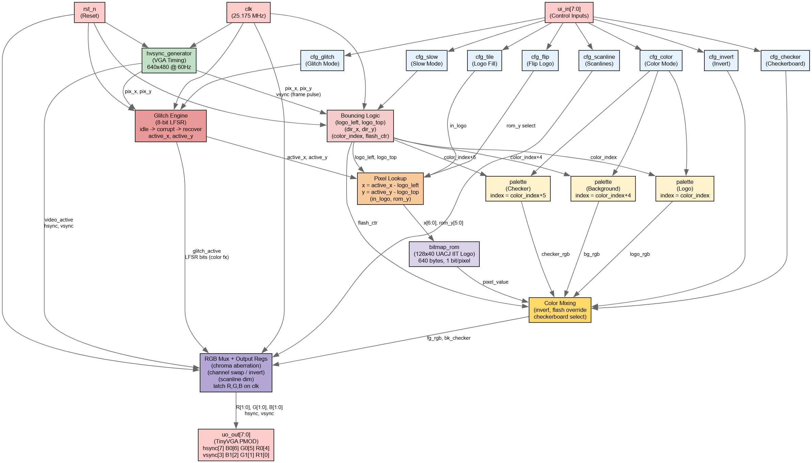

<!---

This file is used to generate your project datasheet. Please fill in the information below and delete any unused
sections.

You can also include images in this folder and reference them in the markdown. Each image must be less than
512 kb in size, and the combined size of all images must be less than 1 MB.
-->

# DVD Screensaver with UACJ IIT Logo

## How it works

This project implements a **DVD-style bouncing logo** on a VGA monitor. The logo is a 128×40 bitmap that displays **UACJ IIT**. The design is written in Verilog and targets the Tiny Tapeout ASIC shuttle.

The system is composed of six main blocks: a VGA sync generator, bouncing logic with position registers, a bitmap ROM containing the logo pattern, a three-instance color palette, an RGB output multiplexer with scanline and glitch effects, and a VHS-style glitch/corruption engine. The diagram below shows the overall architecture.



_**Figure 1.** Block diagram of the DVD screensaver system._

### Block description

- **hvsync_generator** – Generates the HSync and VSync timing signals required for a 640×480 @ 60 Hz VGA display. It also produces the current pixel coordinates (`pix_x`, `pix_y`) and an active video flag (`video_active`).

- **Bouncing Logic & Position Registers** – Maintains the current top‑left corner position of the logo (`logo_left`, `logo_top`) and the direction of movement (`dir_x`, `dir_y`). On each frame (detected during vertical blanking), the position updates by one pixel. When the logo reaches a screen edge it bounces, increments the color index, and triggers a white flash. An optional `cfg_slow` mode halves the movement speed by updating only on every other frame.

- **bitmap_rom** – A 640‑byte ROM (40 rows x 16 bytes/row) that stores the 128x40 UACJ IIT logo. Each bit represents one pixel: `1` for logo foreground, `0` for background. The ROM is addressed by the current pixel position relative to the logo's top‑left corner.

- **palette** – Three instances of an 8‑entry color palette (6‑bit RGB, 2 bits per channel). The logo color cycles through the palette on each bounce. The background color is offset by +4 indices, and a checkerboard accent color is offset by +5 indices. A `cfg_color` input selects between color (palette) and monochrome (white on black).

- **Checkerboard Background** – When `cfg_checker` is enabled, the background tiles alternate between two colors using a 16x16 XOR pattern (`pix_x[4] ^ pix_y[4]`), adding visual depth behind the bouncing logo.

- **CRT Scanline Effect** – When `cfg_scanline` is enabled, every odd-numbered row has its RGB channels halved, simulating the dark lines of a CRT display.

- **Glitch / Corruption Engine** – A VHS-style corruption effect driven by an 8-bit LFSR (taps at bits 7, 5, 4, 3). The engine has three states: idle, corrupt, and recover. While active it applies:
  - **Horizontal XOR scrambling** – pixel X coordinates are XOR'd with an LFSR-derived mask scaled by glitch intensity.
  - **Vertical XOR scrambling** – pixel Y coordinates are similarly distorted.
  - **Horizontal tearing** – selected rows are offset by a pseudo-random amount, simulating VHS tape tracking errors.
  - **Chromatic aberration** – each RGB channel is XOR'd with independent LFSR bits.
  - **Channel swapping** – R↔G and G↔B swaps are triggered pseudo-randomly.
  - **Inversion flash** – at maximum intensity, colors are fully inverted on random pixels.
  
  The glitch can be triggered manually by pressing `cfg_glitch` (rising-edge detected) or fires automatically at pseudo-random intervals while `cfg_glitch` is held high.

- **RGB Mux & Output Registers** – Combines the pixel value (from ROM), the selected colors (from palette), the flash signal, the scanline dimming, and the glitch distortion to produce the final 2‑bit per channel RGB output. The result is latched in registers before being sent to the output pins.

### Configuration inputs

The design accepts eight configuration inputs via the `ui_in[7:0]` pins:

| Pin        | Name          | Description                                                         |
|------------|---------------|---------------------------------------------------------------------|
| `ui_in[0]` | `cfg_tile`    | Debug mode: fill the entire screen with the logo pattern            |
| `ui_in[1]` | `cfg_color`   | 0 = monochrome, 1 = color palette                                   |
| `ui_in[2]` | `cfg_invert`  | Swaps the logo and background colors                                |
| `ui_in[3]` | `cfg_slow`    | Halves the movement speed (update every other frame)                |
| `ui_in[4]` | `cfg_flip`    | Vertically flips the bitmap when reading from the ROM               |
| `ui_in[5]` | `cfg_checker` | Enables the 16×16 checkerboard background pattern                   |
| `ui_in[6]` | `cfg_scanline`| Enables the CRT scanline effect (every odd row darkened)            |
| `ui_in[7]` | `cfg_glitch`  | Activates VHS glitch mode; rising edge triggers a glitch burst; holding high enables auto-glitch at random intervals |

> [!NOTE]
> The VGA output follows the **TinyVGA PMOD** pin mapping:
> `uo_out = {hsync, B[0], G[0], R[0], vsync, B[1], G[1], R[1]}`.
> Connect directly to a TinyVGA PMOD or a compatible VGA DAC.

## How to test

### Simulation testing (CocoTB)

The project includes a CocoTB testbench that verifies the basic functionality. Due to the complexity of VGA simulation, the default test is configured to pass trivially. For full verification, you can implement the following test procedure:

1. **Navigate to the `test` folder** and ensure `test.py` and `Makefile` are present.

2. **Run the simulation** using:
   ```bash
   make
   ```

3. **Expected behaviour** (if you implement full testing):
   - The testbench should generate VGA timing signals and verify that the logo bounces correctly within the 640×480 screen boundaries.
   - On each bounce, the simulation should check that:
     - The direction toggles (horizontal or vertical)
     - The color index increments by 1
     - The flash counter (`flash_ctr`) becomes non-zero
   - The bitmap ROM output should match the expected pattern for the UACJ IIT logo.
   - With `cfg_glitch` asserted, the LFSR should advance each frame and `glitch_state` should transition from idle → corrupt → recover → idle.

### Hardware testing (FPGA or final chip)

#### Required equipment
- VGA monitor (supports 640×480 @ 60 Hz)
- TinyVGA PMOD
- Switches for configuration inputs (optional)
- 25.175 MHz clock source (provided by the Tiny Tapeout harness)

#### Test procedure

**1. Basic functionality test**

Connect the TinyVGA PMOD to your board and to the monitor. Apply power and reset. You should observe:

- The **UACJ IIT logo** bouncing diagonally across the screen
- A brief **white flash** at the moment of impact
- Background colour remains constant (offset from logo colour)

**2. Configuration input tests**

Apply logic levels to the `ui_in[7:0]` pins and observe the behaviour:

| Input combination  | Expected behaviour                                                          |
|--------------------|-----------------------------------------------------------------------------|
| `cfg_tile = 1`     | The entire screen fills with the logo pattern (debug mode)                  |
| `cfg_color = 1`    | Logo changes colors everytime it hits a wall                                |
| `cfg_invert = 1`   | Logo and background colours swap                                            |
| `cfg_slow = 1`     | Logo moves at half speed (updates every other frame)                        |
| `cfg_flip = 1`     | Logo appears upside down (vertical mirror)                                  |
| `cfg_checker = 1`  | Background displays a 16×16 checkerboard pattern with an accent color       |
| `cfg_scanline = 1` | Horizontal dark lines appear across the image (CRT scanline simulation)     |
| `cfg_glitch = 1`   | VHS-style corruption appears; brief pulse triggers a single burst; holding high triggers random bursts automatically |

**3. Boundary testing**

Monitor the logo position as it approaches screen edges:

- It must bounce every time it hits a wall

**4. Flash verification**

The white flash should be visible for approximately 6 frames (about 100 ms at 60 Hz). You can verify this by:
- Using an oscilloscope on the RGB output pins
- Recording the VGA output with a capture card and stepping through frames

**5. Glitch effect verification**

With `cfg_glitch` asserted:
- A rising edge should trigger a single glitch burst lasting 2–17 frames (pseudo-random duration)
- During the burst, observe horizontal tearing, color channel noise, and possible inversion flashes
- After the burst, the image should recover cleanly with no residual corruption
- While `cfg_glitch` is held high, automatic glitch bursts should fire at irregular intervals (approximately every 150 frames when idle)

### Expected results

After successful testing, the system should:
- Bounce reliably off all four screen edges
- Cycle through 8 distinct colours (only on wall hits, not continuously)
- Respond correctly to all eight configuration inputs
- Maintain stable VGA sync (no flickering or rolling image)
- Produce convincing CRT and VHS visual effects when the respective modes are enabled

## External hardware

### Required for operation

| Component | Purpose | Specifications |
|-----------|---------|----------------|
| **VGA monitor** | Display the bouncing logo | 640×480 @ 60 Hz (supports standard VGA timings) |
| **VGA cable** | Connect the board to monitor | Male DB-15 to male DB-15 |
| **TinyVGA PMOD** | Convert digital outputs to analog VGA signals | Uses 6 digital lines (2 bits per colour) + HSync + VSync |
| **Clock source** | Drive the VGA timing | 25.175 MHz (provided by Tiny Tapeout harness) |
